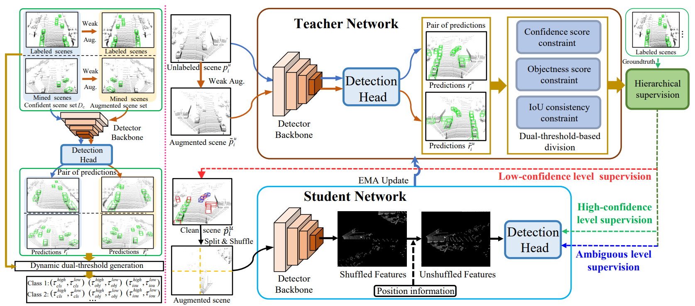

# HSSDA-unofficial

## Introduction
This repository is an unofficial implementation of (CVPR 2023) Hierarchical Supervision and Shuffle Data Augmentation for 3D Semi-Supervised Object Detection (HSSDA) based on [HSSDA](https://github.com/azhuantou/HSSDA).

It aims to refactor the official implementation and reproduce the results in the [paper](https://arxiv.org/abs/2304.01464).

## Installation

Please refer to [INSTALL.md](docs/INSTALL.md) for the installation of `OpenPCDet`.

## Data Preparation
### KITTI Dataset
Preparing...

### Waymo Open Dataset
Preparing...

## Training
Preparing...

## License

`HSSDA-unofficial` is released under the [Apache 2.0 license](LICENSE).

## Acknowledgement
This code is based on [OpenPCDet v0.6.0](https://github.com/open-mmlab/OpenPCDet/tree/aa753ec0e941ddb117654810b7e6c16f2efec2f9) and [HSSDA](https://github.com/azhuantou/HSSDA).
